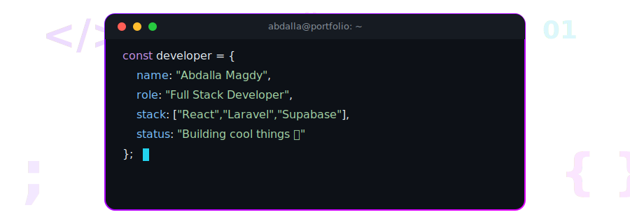
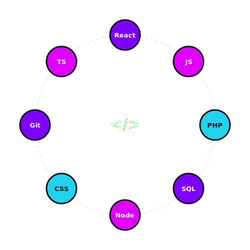

  

  

  
  
  
  

 

### 🚀 About Me

- 🎓 Studying **Computer Science & Statistics** at Helwan University *(Expected 2028)*
- 💻 Full Stack Developer focused on **React / Next.js** front ends and **PHP-Laravel / Supabase** back ends
- 🏆 Led the development of an **ERP system** serving hundreds of students and 70+ government staff
- ⚡ Build fast with **AI-accelerated workflows** (Cursor, Windsurf, Claude) without sacrificing clean architecture
- 🌟 Selected for the **Digital Egypt Cubs Initiative (DECI)** — MCIT's program for exceptional tech talent
- 🗳️ Former **Student Union President** — high school
- 🗣️ Arabic (Native) · English (B2)

 

  

 

  

### 🛠️ Tech Stack

  

**Front End**

  

**Back End & Data Storage**

  

**Tooling & DevOps**

  

**AI Accelerators**

 

  

### 📌 Featured Projects

#### 🏫 Motafawqeen — School Management System (ERP)
*Lead Full Stack Developer · 2023 - Present*
Scalable educational platform serving hundreds of students and 70+ government staff. Built real-time database management, Role-Based Access Control (RBAC), and a secure anti-cheat exam engine using **React, Tailwind CSS, and Supabase** — improving system efficiency by 40%.

#### 🎫 Smart Event Management System — Helwan University
*Front End Web Developer · 2025*
High-performance offline/online QR scanning system for the Faculty of Science, tracking attendance for 5,000+ students. Integrated local SHA-256 encryption for secure offline use with seamless cloud sync, achieving 100% data accuracy.

#### ⏱️ Targetak — Gamified Study Timer
*Freelance Full Stack Developer · 2022 - 2023*
Gamified productivity SaaS app with local and cloud data sync, boosting user engagement by 35%. Built secure authentication flows and Edge Functions with **React, TypeScript, and Supabase**, cutting server response times by 50%.

📂 Full technical details & live demos: **[abd0.pages.dev](https://abd0.pages.dev)**

 

### 📊 GitHub Stats

  
  

  

  

 

### 🐍 Contribution Snake

  <picture>
    <source media="(prefers-color-scheme: dark)" srcset="https://raw.githubusercontent.com/abdallam0gdy/abdallam0gdy/output/github-contribution-grid-snake-dark.svg">
    <source media="(prefers-color-scheme: light)" srcset="https://raw.githubusercontent.com/abdallam0gdy/abdallam0gdy/output/github-contribution-grid-snake.svg">
    
  </picture>

 

### 🏅 Honors & Extracurricular

- **Digital Egypt Cubs Initiative (DECI)** — selected for the Ministry of Communications and Information Technology's program for exceptional tech talent
- **Student Union President** — elected during high school, leading communication and organizational initiatives

 

### 📫 Connect with Me

  
  
  
  

